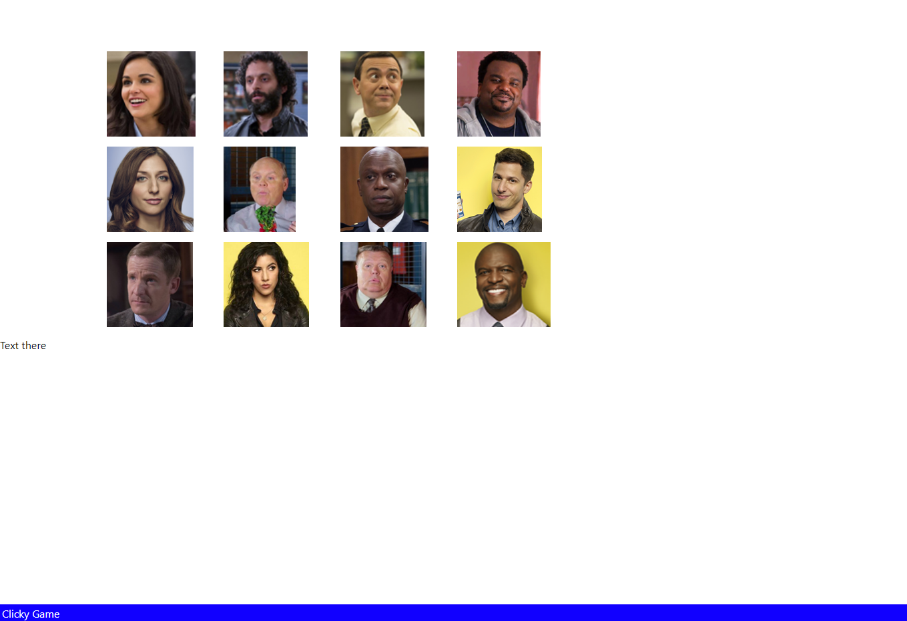

# clicky-game



Description
------------

Game where you have to guess the correct image by clicking on it. You get 1 point for every correct image. Clicking the wrong image makes you lose the game.

 Table of contents
---------------
[Tools used](#Tools-used)<br />
[Deployed here](#Deployed-here)<br />
[Features](#Features)<br />
[Lessons learned](#Lessons-learned)<br />
[Credits](#Credits)<br />
[License](#License)

Tools used
-------------------
* GitBash - Assist with version control via commits, push, and pull to and from GitHub.
* GitHub - Site where the repository lies for deployment and edits.
* React - Library to help build frontend user interfaces. 
* VS Code - Application used to write and edit code for the application.

Deployed here
-------------

Below is the link to the deployed site. <br />
[Link to deployed site](https://vincent-nguyen8931.github.io/clicky-game/)


Features
------------------

The application utilizes React to display the entire code on a single page. Using react allows for an easier way to incorporate javascript code into a template literal style html. This allows data to be directly input into the html instead of routing from other files. However, the use of multiple components is still viable if the developer wishes to use classes. 

The below code snippet utilizes the character.json file and map to display each image. On top of that, the styling also modifies the image to be a set height of 128 pixels and has an onclick listener for each image. This allows further actions to be performed on the images.
```
 {characters.map(character => (
         < img src={character.image} style={{ height: "128px" }} onClick={handleClick}/>
         ))}
```

Lessons learned
---------------------
Dealing with React made some parts complicated and some parts easier. My most difficult challenge has been to bridge the gap of past knowledge and these new React concepts as React did not always take in direct javascript. Some of the solutions I had come up with would cause the application to crash due to memory errors. For this application, I believe seeking further assistance would have been a great step in accomplishing the asks required. 

Credits
---------------
LinkedIn: [https://www.linkedin.com/in/vincent-nguyen-74226a107/](https://www.linkedin.com/in/vincent-nguyen-74226a107/) <br />
GitHub: [https://github.com/vincent-nguyen8931](https://github.com/vincent-nguyen8931) <br />
Portfolio: [https://vincent-nguyen8931.github.io/Vincent-Nguyen-Portfolio/](https://vincent-nguyen8931.github.io/Vincent-Nguyen-Portfolio/)


License
----------
MIT License

Copyright (c) [2021] [Vincent Nguyen]

Permission is hereby granted, free of charge, to any person obtaining a copy
of this software and associated documentation files (the "Software"), to deal
in the Software without restriction, including without limitation the rights
to use, copy, modify, merge, publish, distribute, sublicense, and/or sell
copies of the Software, and to permit persons to whom the Software is
furnished to do so, subject to the following conditions:

The above copyright notice and this permission notice shall be included in all
copies or substantial portions of the Software.

THE SOFTWARE IS PROVIDED "AS IS", WITHOUT WARRANTY OF ANY KIND, EXPRESS OR
IMPLIED, INCLUDING BUT NOT LIMITED TO THE WARRANTIES OF MERCHANTABILITY,
FITNESS FOR A PARTICULAR PURPOSE AND NONINFRINGEMENT. IN NO EVENT SHALL THE
AUTHORS OR COPYRIGHT HOLDERS BE LIABLE FOR ANY CLAIM, DAMAGES OR OTHER
LIABILITY, WHETHER IN AN ACTION OF CONTRACT, TORT OR OTHERWISE, ARISING FROM,
OUT OF OR IN CONNECTION WITH THE SOFTWARE OR THE USE OR OTHER DEALINGS IN THE
SOFTWARE.